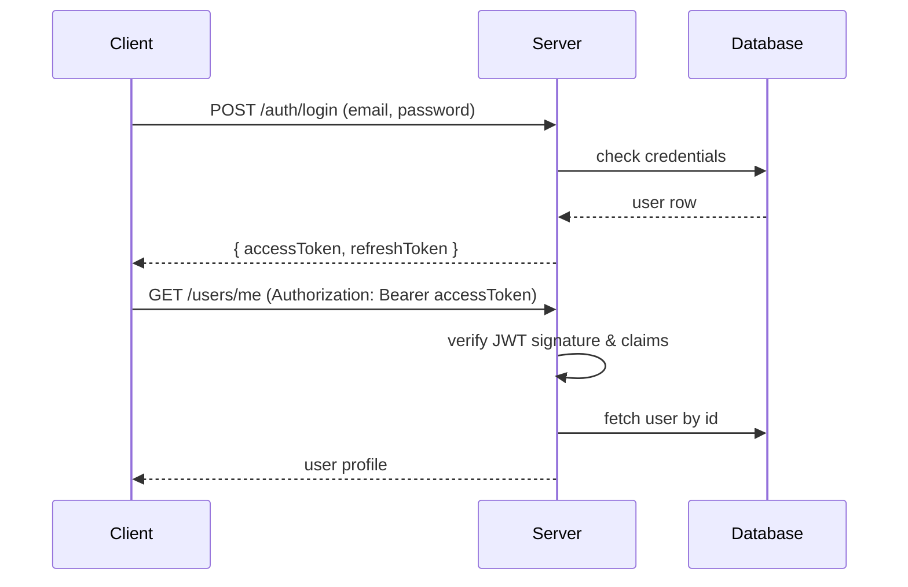
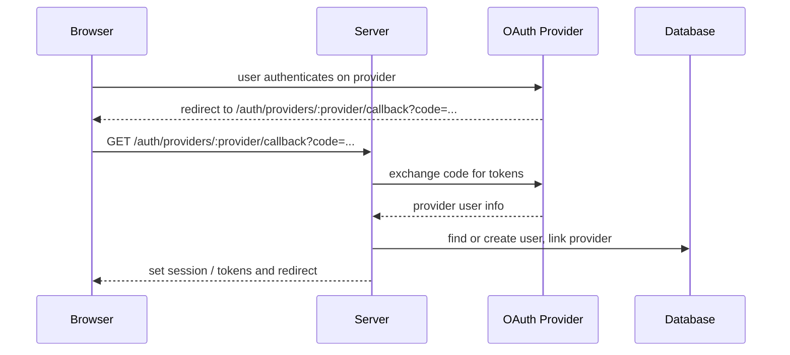

# API — Authentication & User Management

Base path: /api or /

All endpoints below assume JSON requests/responses unless noted otherwise.

## Auth endpoints

### POST /auth/signup
- Purpose: Create user + send verification email
- Body:

```json
{
  "email": "user@example.com",
  "password": "strong-password",
  "name": "Full Name"
}
```

- Response 201:

```json
{
  "id": "uuid",
  "email": "user@example.com",
  "is_verified": false
}
```

- Errors: 400 validation, 409 email exists

### POST /auth/login
- Purpose: Authenticate and return tokens
- Body:

```json
{
  "email": "user@example.com",
  "password": "password"
}
```

- Response 200:

```json
{
  "accessToken": "<jwt>",
  "refreshToken": "<opaque-token>",
  "expiresIn": 900
}
```

### POST /auth/refresh
- Purpose: Exchange refresh token for new access token
- Body:

```json
{
  "refreshToken": "<opaque-token>"
}
```

- Response 200:

```json
{
  "accessToken": "<jwt>",
  "refreshToken": "<new-opaque-token>",
  "expiresIn": 900
}
```

### POST /auth/logout
- Purpose: Revoke current session/refresh token
- Auth required: yes (accessToken or refresh token)
- Response: 204 No Content

### GET /auth/providers/:provider/callback
- Purpose: OAuth callback from external provider
- Notes: server-side exchange and user linking/creation

## User management

### GET /users/me
- Auth required: yes
- Response 200:

```json
{
  "id": "uuid",
  "email": "user@example.com",
  "name": "Full Name",
  "is_verified": true
}
```

### PATCH /users/me
- Body: partial user fields (name, preferences)
- Response 200: updated user

## Auth sequence (login + protected request)



## OAuth callback



## Errors & codes
- 400 Bad Request — validation  
- 401 Unauthorized — invalid or expired token  
- 403 Forbidden — insufficient rights  
- 404 Not Found — resource missing  
- 429 Too Many Requests — rate limits

## Examples
cURL login:

```bash
curl -X POST https://localhost:3000/auth/login \
  -H "Content-Type: application/json" \
  -d '{"email":"x","password":"y"}'
```

Postman collection: `docs/postman/auth.postman_collection.json` (optional)