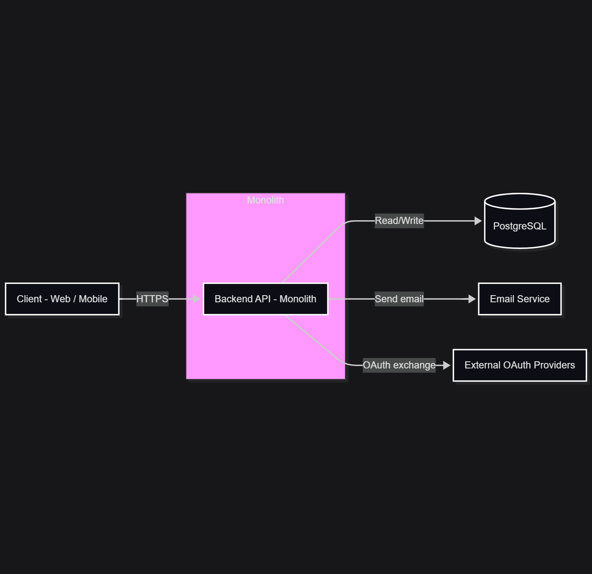
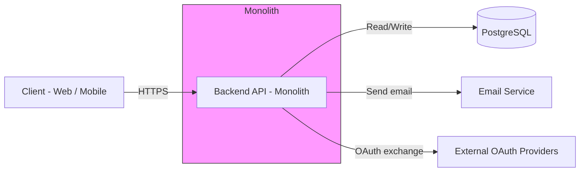
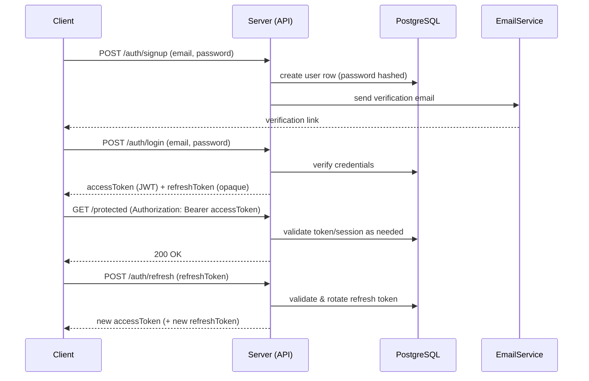

# Authentication & User Management — Architecture

## Overview
This epic provides authentication and user management features for the backend:
- Signup, login, logout
- Access/refresh token lifecycle
- Email verification and password reset
- Social login (OAuth) via external providers
- User CRUD and profile management

## Responsibilities
- Centralized auth logic and session handling
- Secure credential storage and recovery flows
- Integrations with external identity providers

## System diagram

If you prefer inline diagrams while the final PNG is added, here's a mermaid flowchart showing the system components:

## High-level flow (request lifecycle)
1. Client -> POST /auth/signup  
2. Backend validates input, creates user, hashes password, sends verification email  
3. Client -> POST /auth/login -> returns access token (short-lived) and refresh token (long-lived)  
4. Client uses access token to call protected APIs (Authorization: Bearer <access_token>)  
5. When access token expires, client POSTs /auth/refresh with refresh token for a new access token  
6. Logout invalidates refresh token / session

### Signup / Login / Refresh sequence

## Directory & service overview
- src/
  - controllers/auth
  - services/auth
  - models/user
  - migrations/
- Database: PostgreSQL
- Local dev: Docker Compose with db and backend services

## Notes
- All tokens must be signed with environment-stored secrets.
- See security.md for crypto, token rotation, and storage guidance.