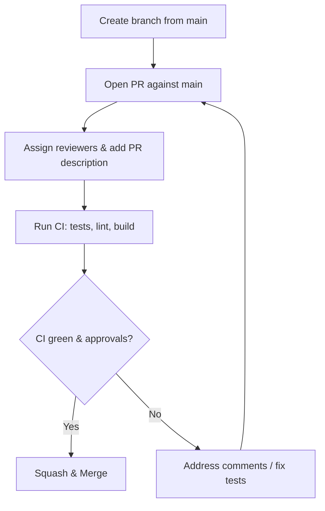

# Contributing — Auth & User Management

## Goals
Maintain consistent code quality and secure authentication code.

## Branching & naming
- Feature branches: feat/auth-<short-desc>
- Bugfix branches: fix/auth-<short-desc>
- Hotfix branches: hotfix/<issue>

## PR process (mermaid)

## Commits
- Use conventional commits:
  - feat(auth): add login endpoint
  - fix(auth): correct token expiry
  - docs(auth): update architecture diagram

## Tests & linting
- Run tests: npm test (or yarn test)
- Run lint: npm run lint
- Run format: npm run format
- Add unit & integration tests for auth flows

## Adding migrations
- Create a migration file named YYYYMMDDHHmm_add_<table>.sql (or using the project's migration tool)
- Update docs/database.md with schema changes
- Add migration tests if possible

## Review checklist (for reviewers)
- Security: Are secrets or plain tokens exposed?
- Edge cases: token expiration, race conditions on refresh
- Tests: adequate unit & integration coverage
- Docs: update docs/ files for schema or endpoint changes