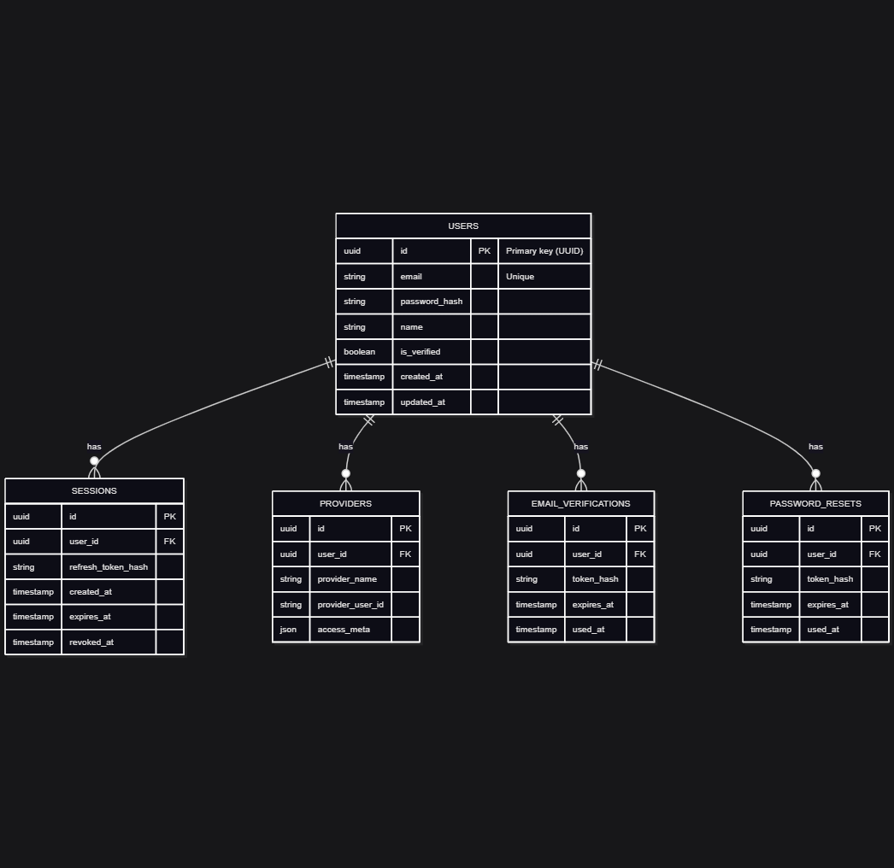
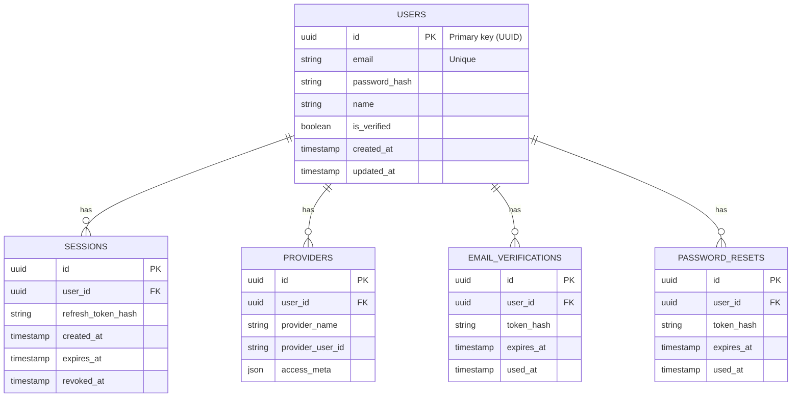

# Database Schema — Authentication & User Management

## Overview
Primary entities:
- users
- sessions (refresh tokens / persisted sessions)
- providers (social login metadata)
- email_verifications
- password_resets

## ERD (diagram)

If a visual ERD PNG is not yet available, here is a mermaid erDiagram representing the core relationships:

## Tables (summary)

- users
  - id (uuid, pk)
  - email (unique, indexed)
  - password_hash (nullable for social-only accounts)
  - name
  - created_at, updated_at
  - is_verified (boolean)

- sessions
  - id (uuid, pk)
  - user_id (fk -> users.id)
  - refresh_token_hash
  - created_at, expires_at
  - revoked_at (nullable)

- providers
  - id
  - user_id (fk)
  - provider_name (e.g., google)
  - provider_user_id
  - access_meta (json)

- email_verifications
  - id
  - user_id
  - token_hash
  - expires_at
  - used_at

- password_resets
  - id
  - user_id
  - token_hash
  - expires_at
  - used_at

## Indexes & constraints
- unique(email) on users  
- index on sessions.expires_at for cleanup  
- foreign key constraints cascade on delete where appropriate

## Migrations
- Default (recommended) commands (pick the one your project uses):
  - Prisma: `npx prisma migrate dev --name init_auth`
  - TypeORM CLI: `npm run typeorm:migration:generate -- -n InitAuth`
  - Knex: `npx knex migrate:latest`
  - Generic: `npm run migrate`
- Include a timestamped migration file for each table and update docs/database.md with schema changes.

## Notes
- Store token values only as hashes (never plaintext).
- Prefer UUIDs for primary keys to avoid enumeration.