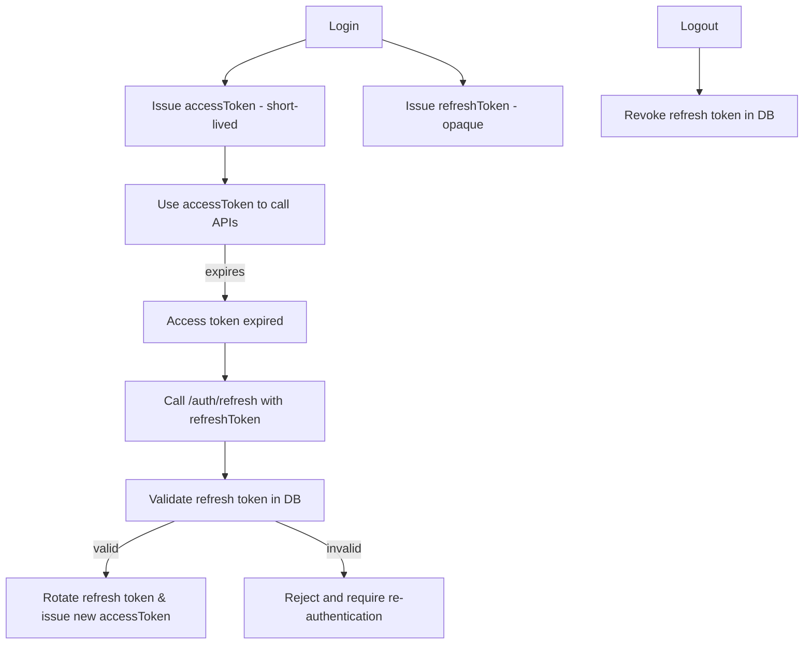
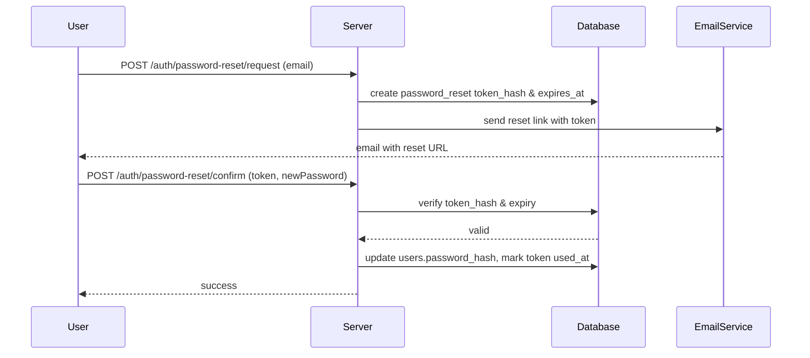

# Security — Authentication & Token Handling

## Token types
- Access token (JWT)
  - Short expiry (e.g., 15 minutes)
  - Contains minimal claims (sub, iat, exp, roles)
  - Signed with a private secret (HS256 or RS256 recommended)
- Refresh token (opaque)
  - Long expiry (e.g., 7–30 days)
  - Stored server-side hashed in sessions table
  - Rotated on use (issue new refresh token and revoke old)

## Token lifecycle

## Storage & transport
- Access tokens: stored in client memory or secure HttpOnly cookie  
- Refresh tokens: HttpOnly cookie or secure storage; prefer HttpOnly cookie for web  
- Use TLS for all communication

## Token rotation & revocation
- Rotate refresh tokens on each refresh request  
- Store only a hash of the refresh token in DB  
- Mark session revoked_at/TIMESTAMP on logout or theft detection  
- Implement a token reuse detection mechanism (if old refresh used after rotation, revoke all sessions)

## Password handling
- Hash with bcrypt (cost >= 12) or argon2id  
- Enforce strong password rules server-side  
- Never log passwords or tokens

## Email verification & password reset
- Generate single-use tokens with an expiry (e.g., 1 hour)  
- Send tokens as links to the user’s email  
- Store token hashes in DB and mark used_at after use

### Password reset flow

## Rate limiting & brute-force protection
- Rate-limit auth endpoints (signup/login/password reset)  
- Lock or throttle IPs or accounts after repeated failures

## Secrets & configuration
- Keep secrets out of repo (.env, secrets manager)  
- Rotate keys periodically and on suspected compromise  
- Limit secret access by environment or role